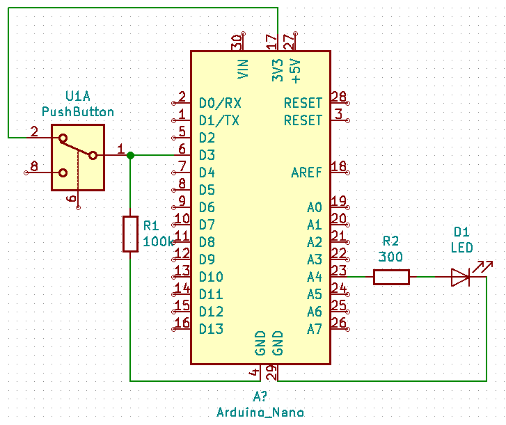

The goal of this project is to make a 'hello world' AI embed project using Arduino.

Detect and analyse a 'morse' like command with either '.' or '__' and a dictionary of 2^3 possibilities: 

	 0 : . . .
	 1 : . . __
	 2 : . __ .
	 3 : __ . .
	 4 : . __ __ 
	 5 : __ . __
	 6 : __ __ .
	 7 : __ __ __

Short pulse duration is set 200ms and long pulse is set to 700ms. AI will manage jitter in the command.

* TensorFlowScripts folder has a python scripts that defines and trains the NN, and then connects to Arduino board to wait for 'click' commands.
* triclickAI folder holds the arduino code that waits for 3 consecutives click in less than 3s, and send data on the serial link if ok.

Next step is to embed the trained NN in the Arduino.

